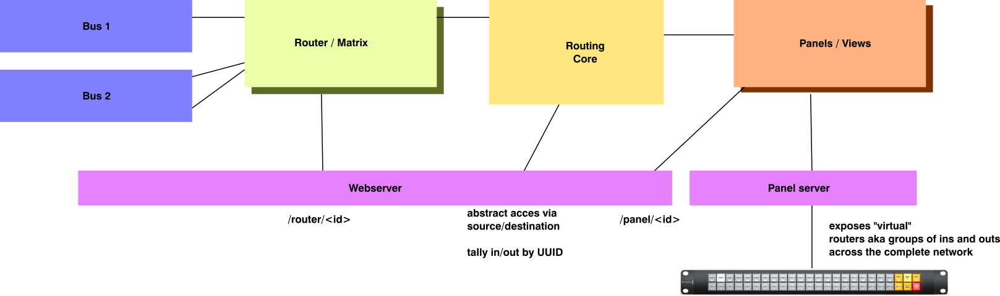

# RouterCtl - a broadcast video router control solution

This project is still in an aerly stage but already contains several backend protocol drivers that can connect to existing video (and other signal) routers from
well known manufacturers.

## Project goal
The goal of this project is to create a one-stop solution for broadcast video routing control for smaller studios and even distributed setups.

### Planned (minimum viable product) feature set:
 * provides a common interface to the most relevant SDI routers
 * virtual (browser based) control panels
 * support for hardware control panels (any supported panel controls any supported router, no matter the manufacturers)
 * REST API (at the core of the web panels) allows for easy integration with 3rd party software
 * integrated web server for eaysy control

### Advanced features (that will be added later down the line)
 * Tally handling, tally applied to one output automatically is forwarded to both the source as well as all other destinations connected to the source
 * Virtual routers (define any subset of inputs/outputs) to allow for multi destination delegation panels
 * Trunk Line support - route your SDI signals between routers, sites and formats
 * Automatic Processor insertion
 * Multi Site support, interconnect multiple instances of this software to keep each branch up and running even if the WAN link fails
 * OBS support (especially for tally)
 * BMD Atem support for tally and aux routing

## License
This project is available under the GPL v3.
